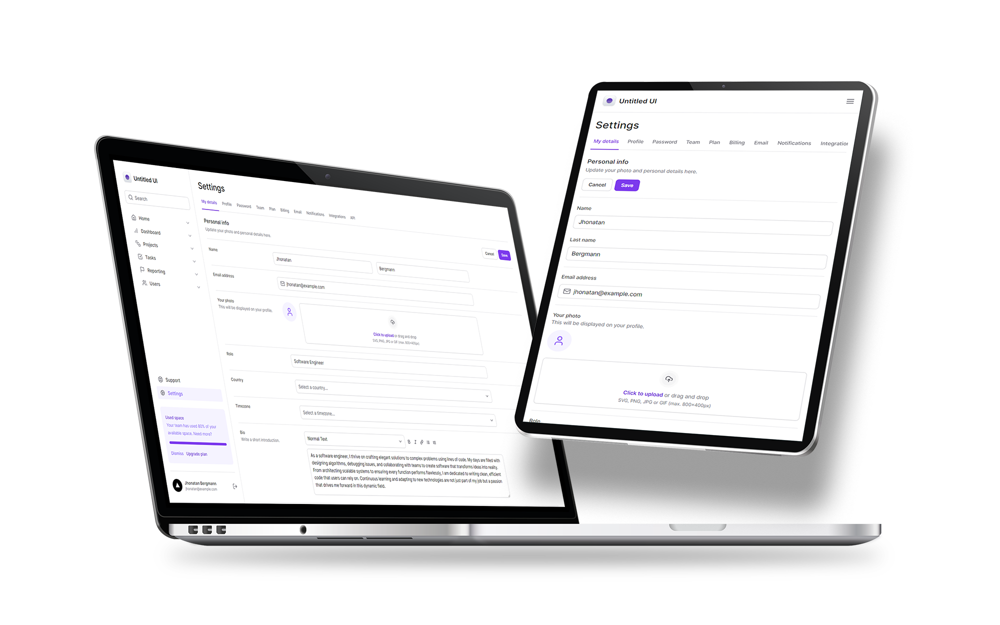

<h1 align="center">
  
</h1>

  
  
  

creative interface :)

 

  

## 🌐 Done with

- Next
- Typescript
- Tailwind CSS
- Radix UI
- Lucide
- Framer Motion

[check in package.json](/package.json)

## **_</>_** Installation

1. Install **Yarn** on your computer
1. Clone this repository `git clone https://github.com/jhonbergmann/untitled-ui.git`

### ⚙️ Usage

1. Access the directory and give the command `yarn install`
1. Access the folder and give the command `yarn dev`
1. Now access the following url in your browser `http://localhost:3000`

## 📝 License

[MIT © Jhonatan Bergmann](https://github.com/)
